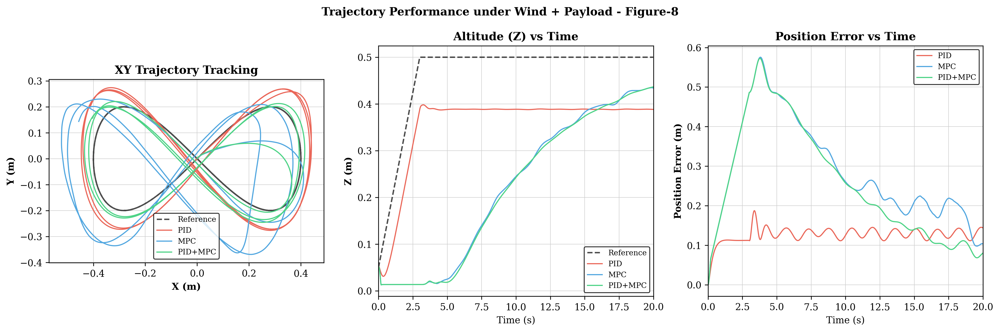
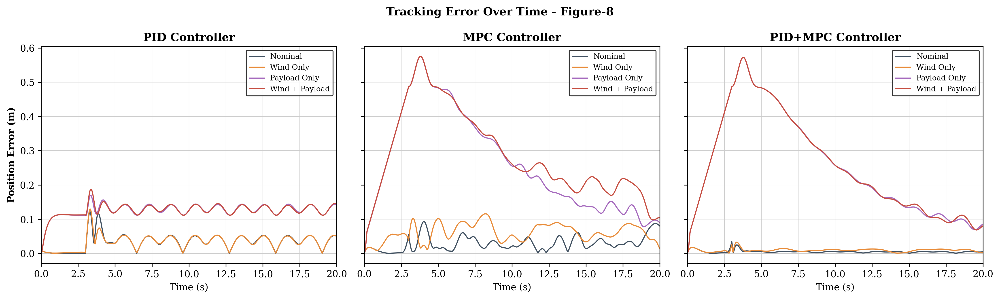
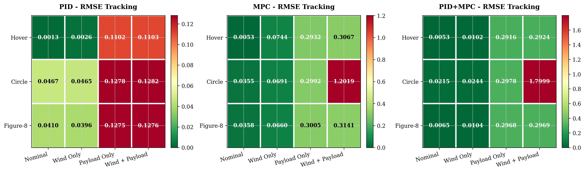
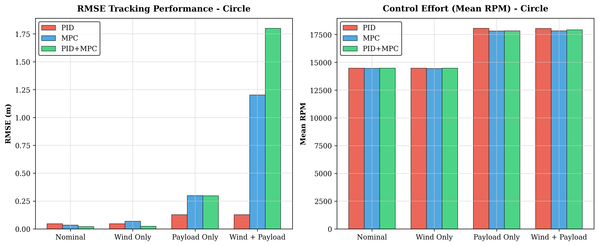

# 🚁 Adaptive Lyapunov-Guided PID+MPC Hybrid Control for Nano-UAVs

**Research Project — IIIT Sri City**
In collaboration with Sakthi Swarrup J, Dept. of CSE

A simulation study on making nano-drones smarter about *when* to think hard. Instead of running expensive trajectory planning at a fixed rate, this controller watches a real-time stability metric and decides — is the drone stable right now, or is something going wrong? If things are fine, it relaxes. If a wind gust hits or a payload changes the weight mid-flight, it immediately ramps up to prevent failure.

---

## The Problem

Nano-UAVs like the Crazyflie 2.x (27g) are extremely sensitive to disturbances. Two classical approaches exist:

- **PID** — Fast and simple, but falls apart when conditions change
- **MPC** — Handles disturbances well, but computationally expensive and fragile when pushed to its limits

Neither works well alone under combined real-world disturbances (wind + payload). Existing hybrid PID+MPC systems fix the execution rate of both layers — which wastes compute when stable, and responds too slowly when things go wrong.

---

## ⚡ The Idea

Use a **Lyapunov stability margin** σ as a real-time health indicator for the drone:

- σ > 0 → energy is decreasing → drone is converging → relax
- σ < 0 → energy is growing → something is wrong → respond

This single value drives two adaptive mechanisms:

**1. Adaptive MPC Frequency Scheduler**
Dynamically adjusts how often the outer-loop MPC solves — between 12 Hz (stable, saving compute) and 48 Hz (disturbance detected, maximum precision).

**2. Adaptive PID Gain Scheduler**
Scales Kp, Ki, Kd in real time based on stability deficit and tracking error — no offline tuning needed across conditions.

---

## 📉 Results (36 simulation trials, PyBullet + Crazyflie 2.x)

| Condition | Trajectory | PID RMSE | MPC RMSE (fixed) | PID+MPC RMSE (ours) |
|-----------|-----------|----------|-------------------|---------------------|
| Nominal | Figure-8 | 0.041m | 0.037m | **0.0065m** (-83%) |
| Wind Only | Figure-8 | 0.040m | 0.069m | **0.011m** (-85%) |
| Wind Only | Circle | 0.047m | 0.069m | **0.024m** (-65%) |
| Payload Only | Hover | 0.110m | 0.293m | **0.292m** |
| Wind+Payload | Figure-8 | 0.128m | 0.314m | **0.297m** |
| Wind+Payload | Circle | 0.128m | 💥 1.20m | 💥 1.80m |

The most striking result: under combined wind and payload on Circle, fixed-rate MPC completely loses control 💥 (max error 4.79m, unbounded drift). The adaptive controller also struggles here — this is the hardest scenario, and an honest limitation worth noting.

But in clean and single-disturbance conditions, the improvement is massive — **60% to 85% RMSE reduction** over both baselines.

Also notable: despite doing more computation when needed, **mean step time for PID+MPC (9.8ms) is lower than fixed MPC (10.6ms)** — because it runs the expensive solver only when the Lyapunov monitor demands it.

### 🚁 Spatial Tracking — Figure-8 Trajectory



The green curve (PID+MPC) hugs the reference trajectory tightly, while PID (blue) drifts outward and fixed MPC (orange) shaves corners due to its rigid execution rate.

### ⚡ Real-Time Tracking Error — Figure-8



Notice how the adaptive controller suppresses the initial transient within ~1.5 seconds and maintains a tight error envelope throughout. The adaptive frequency scheduler ramps up the MPC rate when error spikes, then relaxes back to save compute.

### 📉 RMSE Heatmap — All 36 Runs



Cooler colors = lower RMSE = better tracking. The PID+MPC column stays consistently dark across nominal and single-disturbance scenarios, showing strong robustness. The warmer cells under combined wind+payload reflect the known limitation.

### Performance Comparison — Circle Trajectory



---

## How to Run

```bash
python -m adaptive_hybrid_control.main
```

Choose from:
- **Mode 1** — Single simulation: pick trajectory, condition, and controller, watch it live in PyBullet GUI
- **Mode 2** — Batch experiments: runs all 36 combinations headlessly, saves `.npz` data and regenerates all figures

---

## Repository Structure

```
adaptive_hybrid_control/
├── config.py              # Drone parameters, frequency ranges
├── traj.py                # Hover, Circle, Figure-8 trajectories
├── controllers/
│   ├── mpc.py             # Outer-loop Linear MPC (cvxpy/osqp)
│   └── adaptive.py        # Lyapunov monitor + schedulers
├── simulation/
│   ├── env_setup.py       # PyBullet environment, wind, payload
│   └── sim_loop.py        # Main simulation loop
├── plotting.py            # Academic and standard plot themes
└── main.py                # Interactive CLI runner

experiment_results/
├── Plots_pdf_version_may8 (final_results_version)/   # Final PDF plots
├── Plots_png_version_may8 (final_results_version)/   # Final PNG plots
├── Plots_png_version_may7/                           # May 7 baseline plots
├── figures_old/                                      # Earlier visualizations
├── raw_data/              # .npz files for all 36 runs
└── tables_new/            # RMSE comparison tables

figures/                   # Trajectory, error, barplot, heatmap plots
results.txt                # Appended run logs for every simulation
```

---

## Tech Stack

Python, PyBullet, CVXPY, OSQP, NumPy, Matplotlib, SciPy

Drone platform: **Crazyflie 2.x** (simulated via `gym-pybullet-drones`)

---

## Paper

Full methodology, math, and results in `Results_Final_Report.pdf`

Covers: quadrotor dynamics model, DARE-based Lyapunov construction, adaptive scheduling laws, and comparative analysis across all 36 trials.
